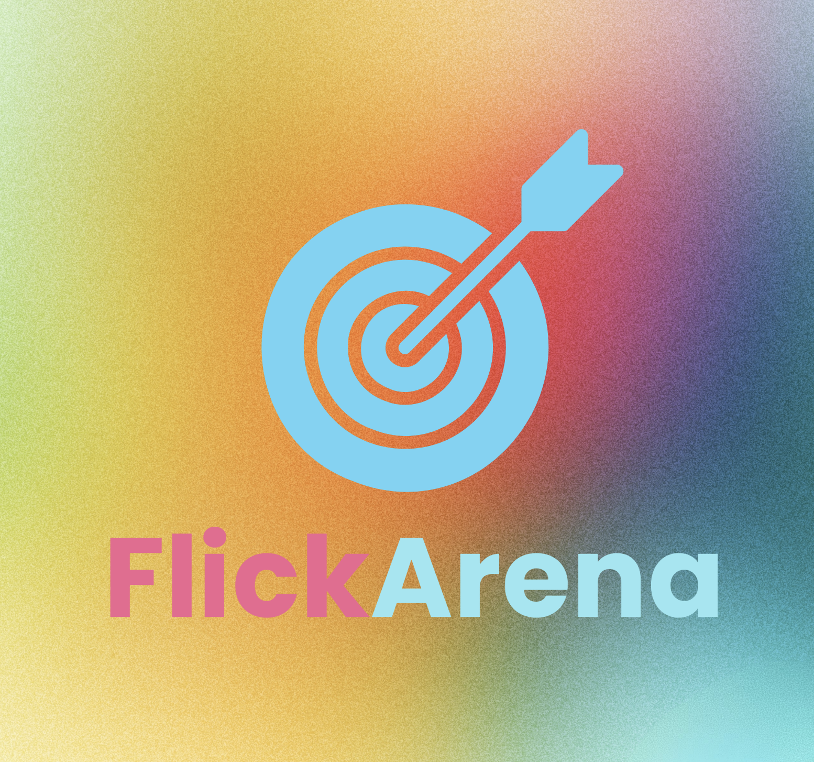
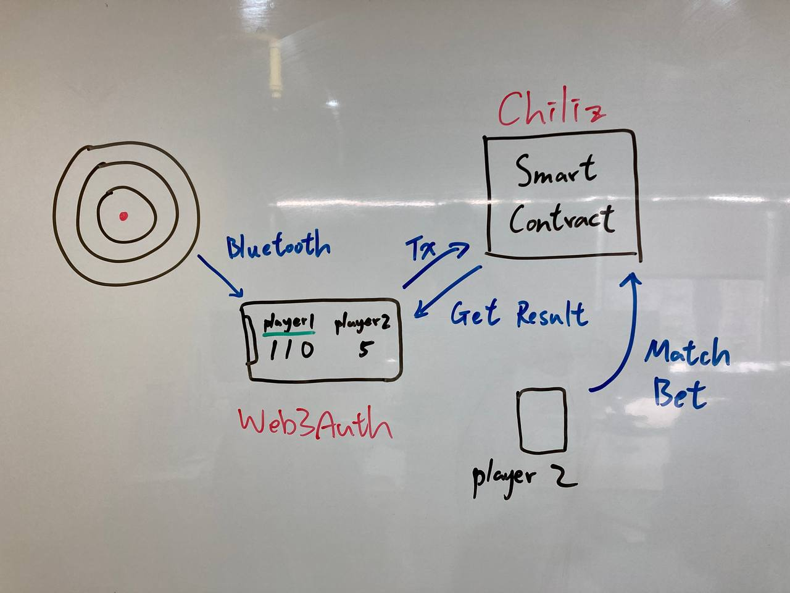

# FlickArena

FlickArena is an innovative on-chain game that combines the excitement of physical dart throwing with blockchain technology.

## System Design

## Overview

FlickArena integrates a physical dart board with smart contracts, creating a unique gaming experience where players' real-world dart throws are recorded and verified on the blockchain.

## Features

- Physical dart board integration
- Blockchain-based score verification
- Smart contract-powered gameplay
- Token rewards for skilled players

## How It Works

1. Players throw darts at the physical board
2. Sensors capture throw data and send it to our iOS app through BLE
3. Data is sent to the blockchain
4. Smart contracts verify and record scores
5. Players earn tokens based on performance

## Technology Stack

- Ethereum blockchain Chiliz
- Solidity smart contracts
- IoT sensors for dart board
- Web3.swift for mobile integration

## Getting Started

Host create a game from the factory contract and share the game address with players.
After the other player send funds to the game contract, they can start the game.

## Future Development

To create a social experience where you can challenge your friends to a game of FlickArena.

## Contributing

We welcome contributions! Please open a pull request here on github.

## License
Apache-2.0 license