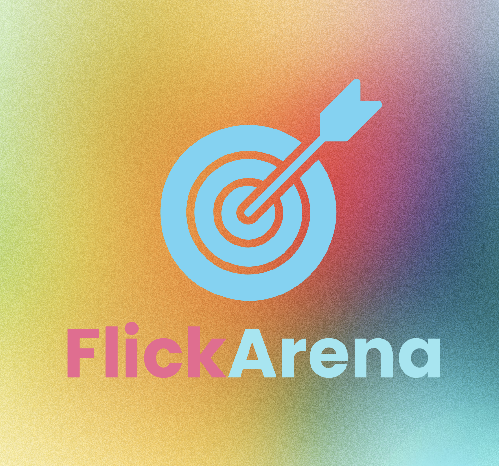
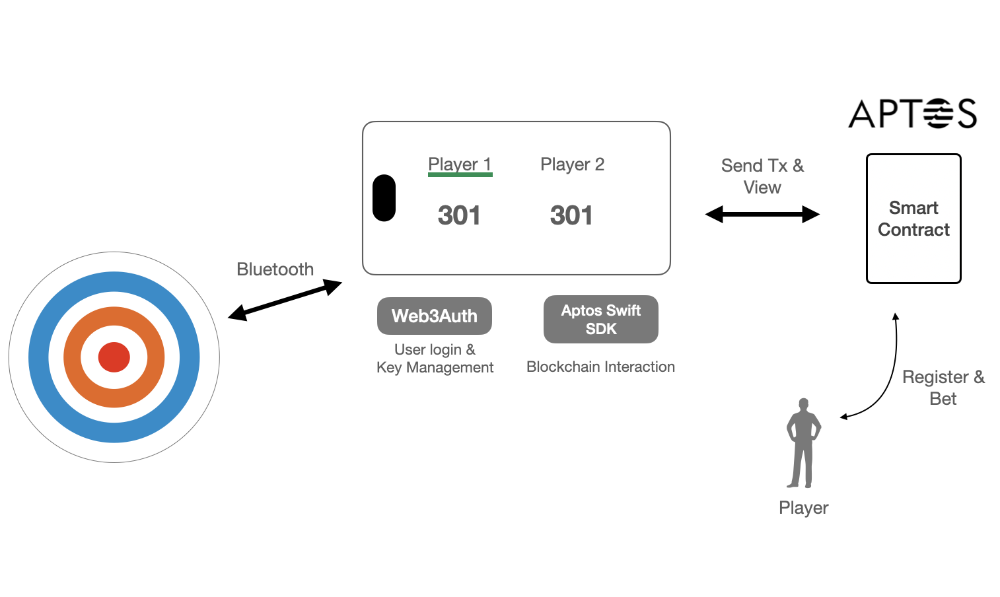
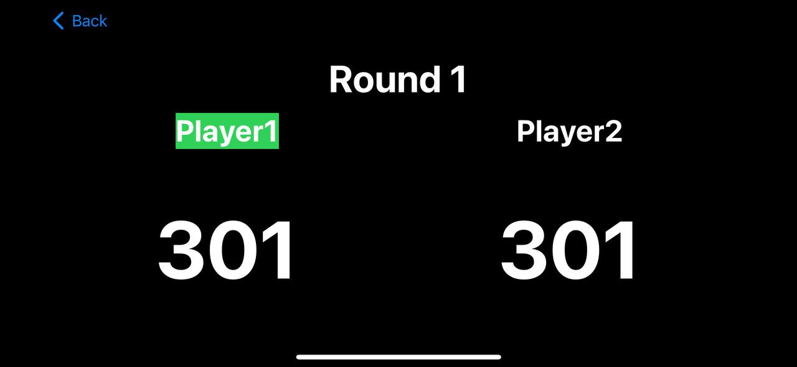

# FlickArena

FlickArena is an innovative on-chain game that combines the excitement of physical dart throwing with blockchain technology.

## System Design

## Overview

FlickArena integrates a physical dart board with smart contracts, creating a unique gaming experience where players' real-world dart throws are recorded and verified on Aptos blockchain.

## Demo Video

https://youtu.be/SoAa28u1Q9I

## Screenshots

## Features

- Physical dart board integration
- Blockchain-based score verification
- Smart contract-powered gameplay
- Token rewards for skilled players

## How It Works

1. The host initialize a game with the game contract
2. The other player send funds to the game contract to start the game
3. Players throw darts at the physical board
4. Sensors capture throw data and send it to our iOS app through BLE
5. Data is sent to the blockchain
6. Smart contracts verify and record scores
7. Players earn tokens based on the game result

## Technology Stack

- [Aptos](https://aptos.dev/en) blockchain
- Move smart contracts
- IoT sensors for dart board
- [Web3Atuh](https://web3auth.io/) for user boarding and key management
- [Aptos Swift SDK](https://aptos.dev/en/build/sdks/community-sdks/swift-sdk) for mobile integration

### Contract Address on Aptos Testnet

- Game contract: https://explorer.aptoslabs.com/account/0x149a7bf28cd1d8bdb1bc3328ebbe330a10f63035f4e1b79aad1cdc8baa64ab69/modules/code/game?network=testnet

## Future Development

To create a social experience where you can challenge your friends to a game of FlickArena.

## Contributing

We welcome contributions! Please open a pull request here on github.

## License

Apache-2.0 license
